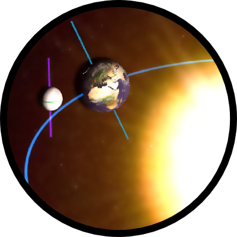

<!---->
# 0203 - Day / Night / Seasons

## Short Description

<table align="center">
    <tr>
    <td align="left" style="font-style:italic; font-size:12px; background-color:white">Explore the seasons! 
        Use the touch screen to explore how day and night take turns and why seasons exist. 
        Try the different views and find out how the seasons are opposite in the two hemispheres.</td>
    </tr>
</table>

The application shows basic dependencies between the Sun, Earth and Moon with special emphasis on the seasons. The concept of day and night interchanging can be observed and explained. The user can explore the concept of seasons and see how they differ on the northern and the southern hemisphere. 

Position, velocity and axial tilt of the Earth can be modified to observe these dependencies. The positions jump to four chosen locations or continuously change if velocity is not zero. Heat impact map of the Sun on the Earth can be turned on to better explain the concept of the seasons. Season labels can help understand the influence of the Earth’s axial tilt on their existence. Various camera views and different rotation centers can be chosen to obtain a better understanding of the concepts. There is an option to show the true speed ratios of the Earth rotating around the Sun (~365 times per one full circle i.e. one year) and the Moon rotating around the Earth (~12 times per year). The main view can be rotated and zoomed (using two fingers / mouse wheel). Three buttons in the lower left corner allow the user to restart the application, change the language (English or German) and get some help. 

Note that the size and distance ratios of the Sun, Earth and Moon in this application are wrong, as we would not be able to achieve the desired learning effect. 

This application is used at the [ESO Supernova Planetarium and Visitor Centre](https://supernova.eso.org/?lang=en), Garching b. München.  
For more details about the project and how applications are run and managed within the exhibition please see [this link](https://gitlab.com/HITS_Supernova/overview).   

## Requirements / How-To

A browser with a WebGL support is needed to run the interactive (start `WebGL/webgl_DayNightSeasons.html`).  
If no touchscreen is available the interactive can be operated with the mouse.

## Detailed Information

#### URL parameters

*lang* - language parameter (english as default if not there)

## Credits

This application was developed by the ESO Supernova team at [HITS gGmbH](https://www.h-its.org/en/).  
Idea and coding by Dorotea Dudas, HITS gGmbH. 

#### Code Licensing

* This code is licensed as: [MIT license](LICENSE)
* MIT license:
    * *jQuery* [source](https://jquery.com/)
    * *Three.js* by Mr.doob (Ricardo Cabello) [source](https://threejs.org/)
    * *Star shader* by Dorotea Dudas using:
        * *Lava shader* from [source](https://threejs.org/examples/webgl_shader_lava.html) (MIT license)

#### Image Licensing

* CC BY 4.0:
    * Earth, Moon images (map, clouds, specular, elevation) provided by ESO 
    * Optical Milky Way image: original file by S. Brunier [source at ESO](https://www.eso.org/public/images/eso0932a/)
    * Heat and sprite texture, Sun Icon image by Dorotea Dudas
    * Info/Help Screen images by ESO / HITS gGmbH
    * Icons (except blue navigation icons) by Dorotea Dudas
    * Blue Navigation icons by Design und mehr GmbH
* Moon icon image [source](https://pixabay.com/en/moon-space-earth-s-moon-universe-1099389/) (CC0 Creative Commons)
* Earth icon image from Bjørn Sandvik [Creating a WebGL Earth with three.js](http://blog.mastermaps.com/2013/09/) by Tom Patterson [Natural Earth III – Texture Maps: 1. Deluxe: Earth with edited clouds](http://www.shadedrelief.com/natural3/pages/textures.html) ([public domain license](http://www.shadedrelief.com/natural3/pages/use.html))
* Lava, cloud textures from three.js [image](https://github.com/mrdoob/three.js/tree/dev/examples/textures/) (MIT License)
* Sprite2 texture from AsterTank [GitHub](https://github.com/typpo/asterank) [image](https://github.com/typpo/asterank/tree/master/static/img) (MIT License)

